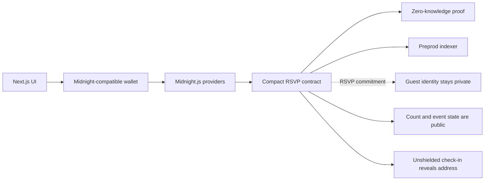

# PrivateParty

PrivateParty is a privacy-preserving RSVP dApp for Midnight. Guests can join a party without publishing their identity or an address on the guest list. The host sees the aggregate RSVP count; a guest's address becomes public only when they deliberately check in with an unshielded NIGHT payment.

## Official Starting Point

The official reference is [midnightntwrk/example-private-party](https://github.com/midnightntwrk/example-private-party). It contains the Compact contract, Vitest local-devnet harness, Docker stack, and Preprod environment examples. This workspace follows that contract and privacy boundary while adding a Next.js web shell.

## Privacy Boundary

| Data | Visibility | Reason |
| --- | --- | --- |
| Party capacity, fee, and state | Public | Needed to discover and manage the event |
| RSVP count | Public aggregate | Lets the host monitor capacity without a guest list |
| Guest address and RSVP secret | Private | Used inside the proof to authenticate the commitment |
| Salted RSVP commitment | Public, unlinkable | Proves duplicate prevention without revealing the address |
| Check-in address and unshielded payment | Public | Unshielded NIGHT intentionally crosses the privacy boundary |

`persistentCommit(address, secret)` stores a salted commitment instead of the guest address. The secret is generated locally and persisted only in the browser for the MVP. Losing it means that guest cannot later prove ownership of that RSVP.

## Architecture



## Contract

The Compact implementation is in `contract/src/private-party.compact`. It supports deployment, private RSVP, organizer-only start/close, check-in, and fee claiming. Organizer authentication uses a DApp-specific key derived from a secret, so the contract does not need a witness or raw wallet identity for that role.

Date, location references, RSVP deadlines, and eligibility rules are application-level metadata for the next slice. Private eligibility attributes must be proved, not stored in public ledger fields.

## Network Configuration

Preprod is the default. Change `NEXT_PUBLIC_MIDNIGHT_NETWORK` to `preview` only when deliberately targeting Preview. Endpoint selection lives in `lib/network.ts`; wallet credentials and seeds are never committed.

Copy `.env.preprod.example` to `.env.preprod` for local configuration. It contains endpoints only and no secrets.

## Local Development

```powershell
npm install
npm run dev
```

The initial web shell is available at `http://localhost:3000`.

For the official Compact/devnet workflow, install the current Compact compiler and Docker Desktop, then use:

```powershell
yarn install
yarn compile
yarn env:up
yarn test:local
```

This workstation could not run those commands because the Compact installer could not resolve GitHub and Docker is not installed. The browser shell does build successfully with `npm run build`.

## Preprod Deployment

Preprod deployment requires a current 1AM-compatible Midnight wallet, funded tNIGHT, proving assets, and the current Midnight.js versions from the official example. Never place mnemonics, seeds, or private keys in this repository.

## Testing Plan

The official harness covers deployment, valid private RSVPs, organizer rejection, duplicate prevention, capacity, party start, check-in disclosure, close, fee claim, and manual deployment. The application-specific extension will add event deadlines and eligibility tests before those fields are introduced into the Compact contract.

## Future Improvements

- Add a host-created event registry and public metadata index.
- Add a Compact deadline check using block time after verifying the current toolchain API.
- Add a privacy-preserving eligibility proof circuit for invitation attributes.
- Replace browser-only secret storage with wallet-backed encrypted private state.
- Add accessible party detail, host dashboard, and guest dashboard routes.
